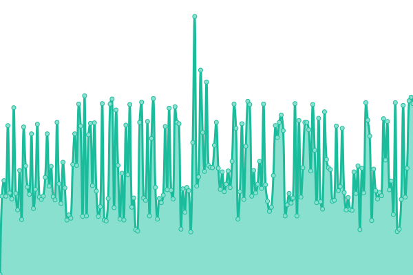
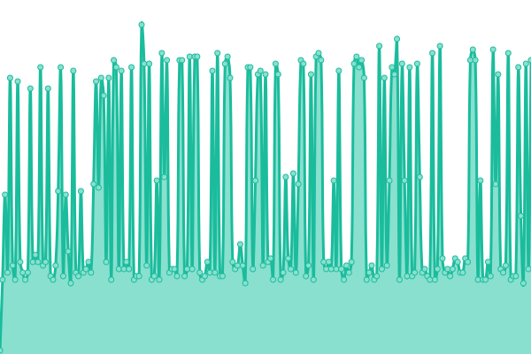
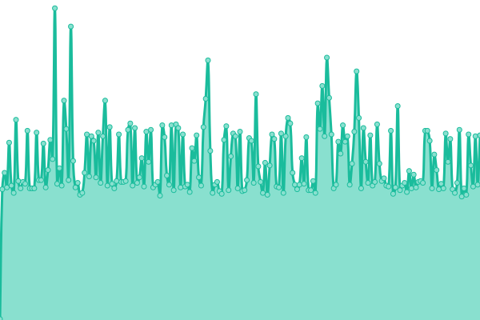

# [📈 Live Status](https://status.autovance.com): <!--live status--> **🟩 All systems operational**

This repository contains the open-source uptime monitor and status page for [Autovance Technologies Inc.](https://status.autovance.com), powered by [Upptime](https://github.com/upptime/upptime).

With [Upptime](https://upptime.js.org), you can get your own unlimited and free uptime monitor and status page, powered entirely by a GitHub repository. We use [Issues](https://github.com/autovance/uptime/issues) as incident reports, [Actions](https://github.com/autovance/uptime/actions) as uptime monitors, and [Pages](https://status.autovance.com) for the status page.

<!--start: status pages-->
<!-- This summary is generated by Upptime (https://github.com/upptime/upptime) -->
<!-- Do not edit this manually, your changes will be overwritten -->
<!-- prettier-ignore -->
| URL | Status | History | Response Time | Uptime |
| --- | ------ | ------- | ------------- | ------ |
|  [Desk](https://skywalker.autovance.com/health) | 🟩 Up | [desk.yml](https://github.com/QuorumDMS/av-uptime/commits/HEAD/history/desk.yml) | 

 247ms
     
 | 

<a href="https://status.autovance.com/history/desk">100.00%</a>
    

|  [MyDeal](https://services.autovance.com/public/health) | 🟩 Up | [my-deal.yml](https://github.com/QuorumDMS/av-uptime/commits/HEAD/history/my-deal.yml) | 

 244ms
     
 | 

<a href="https://status.autovance.com/history/my-deal">100.00%</a>
    

|  [Broker](https://broker.autovance.com/health) | 🟩 Up | [broker.yml](https://github.com/QuorumDMS/av-uptime/commits/HEAD/history/broker.yml) | 

 242ms
     
 | 

<a href="https://status.autovance.com/history/broker">100.00%</a>
    

|  [Exports](https://services.autovance.com/exports/health) | 🟩 Up | [exports.yml](https://github.com/QuorumDMS/av-uptime/commits/HEAD/history/exports.yml) | 

 45ms
     
 | 

<a href="https://status.autovance.com/history/exports">100.00%</a>
    

|  [Authentication](https://skywalker.autovance.com/login) | 🟩 Up | [authentication.yml](https://github.com/QuorumDMS/av-uptime/commits/HEAD/history/authentication.yml) | 

 160ms
     
 | 

<a href="https://status.autovance.com/history/authentication">100.00%</a>
    

<!--end: status pages-->

[**Visit our status website →**](https://status.autovance.com)

## 📄 License

- Powered by: [Upptime](https://github.com/upptime/upptime)
- Code: [MIT](./LICENSE) © [Autovance Technologies Inc.](https://status.autovance.com)
- Data in the `./history` directory: [Open Database License](https://opendatacommons.org/licenses/odbl/1-0/)
